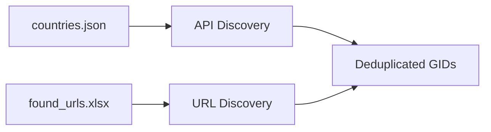
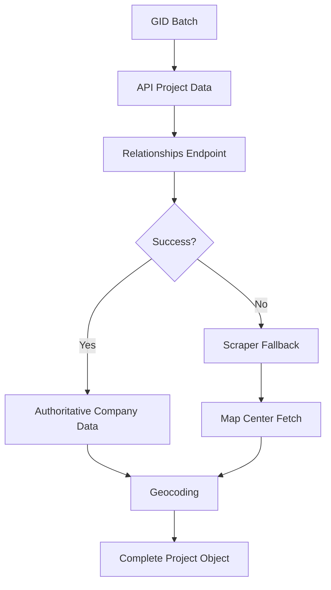
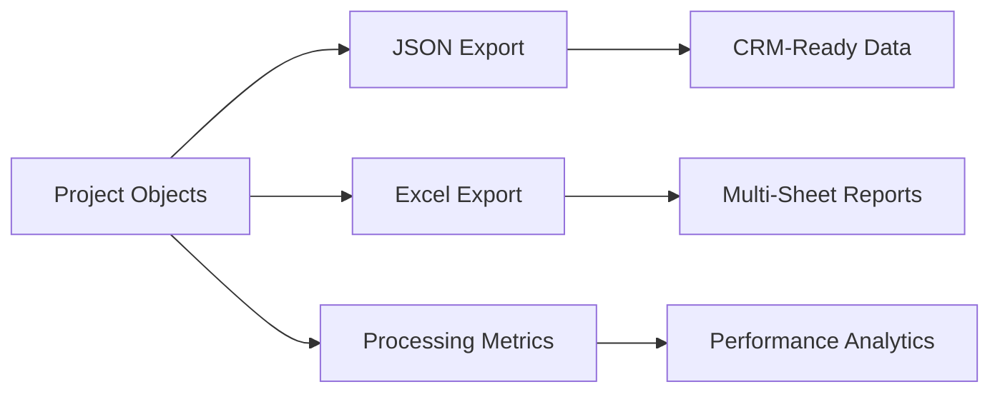

# MiningHub Data Processor

[](https://github.com/michaelshaskey/MiningHub-Scraper)
[](https://12factor.net/)
[](https://www.python.org/)

A cloud-native, modular data processing system for MiningHub project data, built following 12/15-factor app principles for reliable, scalable mining project data extraction and enrichment.

## 🏗️ Architecture Overview

### **Modern Modular Design**
- **Project-Centric**: Single source of truth with unique GID identification
- **Immutable Data**: Thread-safe, predictable data structures  
- **Service-Oriented**: Clear separation of concerns across modules
- **Cloud-Native**: AWS deployment ready with environment-based configuration

### **Key Improvements Over Legacy System**
- ✅ **No Data Corruption**: Eliminated duplicate project processing
- ✅ **Authoritative Company Data**: Always from relationships endpoint first
- ✅ **Graceful Degradation**: API → Relationships → Scraper fallback chain
- ✅ **Proper Error Handling**: Retry logic, rate limiting, structured logging
- ✅ **58% Size Reduction**: Optimized from 112MB to 47MB for deployment

## 🚀 Quick Start

### **Prerequisites**
- Python 3.10+
- Chrome/Chromium browser (for web scraping)
- MiningHub API JWT token

### **Installation**
```bash
# Clone repository
git clone https://github.com/michaelshaskey/MiningHub-Scraper.git
cd MiningHub-Scraper

# Install dependencies
pip install -r requirements.txt

# Configure environment
cp envexample.txt .env
# Edit .env with your JWT_TOKEN
```

### **Basic Usage**
```bash
# Test mode (10 Australian projects, ~30 seconds)
PROCESSING_MODE=test python3 app.py

# Production mode (all 198 countries, ~2-6 hours)
PROCESSING_MODE=production python3 app.py

# Health check
python3 app.py health
```

## 📁 Project Structure

```
├── app.py                          # 🎯 Main application entry point
├── core/                           # 🧠 Core business logic
│   ├── __init__.py
│   ├── assembly.py                 # Project assembly & company resolution
│   ├── discovery.py                # GID discovery from API and URLs  
│   ├── models.py                   # Immutable data structures
│   └── storage.py                  # Data persistence & export
├── services/                       # 🔌 External service integrations
│   ├── __init__.py
│   ├── api_client.py               # MiningHub API client with retry logic
│   ├── geocoding.py                # Location enrichment service
│   ├── map_center.py               # Map coordinate extraction
│   ├── playwright_parallel_scraper.py  # Parallel web scraping
│   └── playwright_scraper.py       # Single-threaded scraper
├── outputs/                        # 📊 Generated data outputs
│   ├── json_outputs/               # CRM-ready JSON data
│   ├── excel_outputs/              # Multi-sheet Excel reports
│   ├── reports/                    # Processing metrics
│   └── cache/                      # Geocoding cache (auto-generated)
├── countries.json                  # 🌍 List of 198 countries
├── found_urls.xlsx                 # 🔗 Project/company URL mappings
├── requirements.txt                # 📦 Python dependencies
└── simple_dependency_tracer.py    # 🔍 Dependency analysis tool
```

## 🎯 Data Processing Pipeline

### **Phase 1: Discovery** 


- **API Discovery**: Call `/projects/filter` for each of 198 countries
- **URL Discovery**: Extract additional GIDs from Excel file
- **Deduplication**: Create unique GID set for processing

### **Phase 2: Assembly** (Batch Processing)


- **Safe Project Data**: Extract location, stage, commodities from API
- **Company Resolution**: Call `/project/relationships` for authoritative company data
- **Scraper Fallback**: Playwright-based scraping if relationships fail
- **Map Enhancement**: 7-second timeout coordinate extraction
- **Geocoding**: Reverse geocode coordinates to addresses

### **Phase 3: Storage & Export**


## ⚙️ Configuration

All configuration via environment variables (`.env` file):

```bash
# Required
JWT_TOKEN=your_mininghub_jwt_token_here

# Processing Mode
PROCESSING_MODE=test              # test|production
BATCH_SIZE=100                    # Projects per batch (optimized)
LOG_LEVEL=INFO                    # DEBUG|INFO|WARNING
LOG_TO_CONSOLE=true               # Also log to console (default: true)

# API Configuration
API_BASE_URL=https://mininghub.com/api
API_TIMEOUT=30
API_RETRY_ATTEMPTS=3

# Feature Toggles  
ENABLE_GEOCODING=true             # Location enrichment
SCRAPER_HEADFUL=false             # Set true for debugging

# Output Settings
OUTPUT_DIR=outputs
```

### **Processing Modes**

| Mode | Scope | Duration | Use Case |
|------|-------|----------|----------|
| `test` | Australia only, 10 projects | ~30 seconds | Development, debugging |
| `production` | All 198 countries | 2-6 hours | Full data extraction |

## 📊 Output Data

### **Primary Outputs**

1. **CRM-Ready JSON** (`outputs/json_outputs/companies_with_projects_*.json`)
   - Companies organized with nested projects
   - Authoritative company data from relationships endpoint
   - Complete project details with location enrichment

2. **Excel Reports** (`outputs/excel_outputs/mining_projects_*.xlsx`)
   - **Projects Sheet**: Normalized project data
   - **Companies Sheet**: Unique company records  
   - **Relationships Sheet**: Company-project associations
   - **Data Sources Sheet**: Processing statistics
   - **Summary Sheet**: Performance metrics

3. **Processing Metrics** (`outputs/reports/processing_metrics_*.json`)
   - Success rates, timing data, error tracking
   - Data source breakdown and coverage analysis

### **Data Schema**

**Project Object:**
```json
{
  "gid": "12345",
  "name": "Copper Mountain Project",
  "location": {
    "latitude": -29.191,
    "longitude": -69.877,
    "country": "Chile",
    "state": "Atacama",
    "geocoded": true
  },
  "stage": "Mining",
  "commodities": "Cu,Au,Mo",
  "operator": "Mining Corp Ltd",
  "company_relationships": [
    {
      "company_id": "456",
      "company_name": "Mining Corp Ltd",
      "relationship_type": "jv",
      "percentage": 75.0,
      "data_source": "relationships"
    }
  ]
}
```

## 🔧 Advanced Usage

### **Individual Pipeline Phases**
```bash
# Run specific phases
python3 app.py discovery         # GID discovery only
python3 app.py assembly          # Project assembly only  
python3 app.py health            # Health check

# Debug mode with verbose logging
LOG_LEVEL=DEBUG python3 app.py

# Visual scraper debugging
SCRAPER_HEADFUL=true python3 app.py
```

### **Dependency Analysis**
```bash
# Analyze project dependencies
python3 simple_dependency_tracer.py

# Results: Shows which files are actually used vs unused
# Core application uses only 10/23 files (43.5% efficiency)
```

### **Performance Tuning**
```bash
# Increase batch size for faster processing
BATCH_SIZE=200 python3 app.py

# Reduce workers if memory constrained  
# Edit core/assembly.py: max_workers = 2

# Disable geocoding for faster runs
ENABLE_GEOCODING=false python3 app.py
```

## 📈 Performance & Monitoring

### **Resource Usage**
- **Memory**: ~600MB per scraper worker + 2GB base system
- **CPU**: ~1 core per worker during active scraping
- **Recommended**: 4 workers max on 8GB system, 6-8 on 16GB+
- **Network**: Stable internet for API calls and web scraping

### **Success Metrics**
- **API Coverage**: >95% of projects have API data
- **Scraping Success**: >90% success rate for fallback
- **Company Resolution**: >80% via relationships endpoint  
- **Processing Speed**: 0.04-0.16 projects/second per worker

### **Built-in Monitoring**
- **Structured Logging**: JSON format saved to timestamped files in `logs/` directory
- **Health Checks**: `/health` endpoint for load balancers
- **Progress Tracking**: Real-time batch processing updates
- **Error Tracking**: Categorized failure analysis
- **Log Files**: `logs/mininghub_processor_YYYYMMDD_HHMMSS.log` (auto-created)

## 🚀 Cloud Deployment

### **12/15-Factor Compliance**
- ✅ **Config**: Environment variables only
- ✅ **Processes**: Stateless, horizontally scalable
- ✅ **Concurrency**: Batch processing with configurable workers
- ✅ **Disposability**: Graceful shutdown (SIGTERM/SIGINT)
- ✅ **Logs**: Structured JSON to stdout
- ✅ **Observability**: Built-in metrics and health checks

### **AWS Ready**
```bash
# Container deployment
docker build -t mininghub-processor .
docker run -e JWT_TOKEN=xxx -e PROCESSING_MODE=production mininghub-processor

# Environment variables for AWS ECS/Fargate
JWT_TOKEN=your_token
PROCESSING_MODE=production
LOG_LEVEL=INFO
OUTPUT_DIR=/app/outputs
```

### **Deployment Optimization**
- **Size**: 47MB deployment package (58% reduction from legacy)
- **Dependencies**: Only 10 core files required
- **Cache**: Auto-regenerating, safe to exclude from deployments
- **Outputs**: Timestamped files, implement cleanup policies

## 🔍 Troubleshooting

### **Common Issues**

| Issue | Cause | Solution |
|-------|-------|----------|
| "No cached data found for GID" | Test mode with production data | Set `PROCESSING_MODE=production` |
| Playwright timeouts | Slow network/pages | Increase timeout or reduce workers |
| JWT token expired | Token needs renewal | Update `JWT_TOKEN` in `.env` |
| Memory issues | Too many parallel workers | Reduce batch size or workers |

### **Debug Commands**
```bash
# Enable debug logging
LOG_LEVEL=DEBUG python3 app.py

# Visual scraper debugging  
SCRAPER_HEADFUL=true python3 app.py

# Check system resources
ps aux | grep chrome | wc -l    # Chrome process count
du -sh outputs/                 # Output directory size
```

## 📚 Documentation

- **API Documentation**: [MiningHub API Reference](https://mininghub.com/api/docs)
- **Architecture Decisions**: See `.cursorrules` for detailed technical context
- **Dependency Analysis**: Run `simple_dependency_tracer.py` for current usage
- **Performance Tuning**: Monitor logs for timing and success rate data

## 🤝 Contributing

1. **Development Setup**
   ```bash
   # Test mode for development
   PROCESSING_MODE=test python3 app.py
   
   # Run dependency analysis
   python3 simple_dependency_tracer.py
   ```

2. **Code Standards**
   - Follow 12-factor app principles
   - Use environment variables for all configuration
   - Implement proper error handling with fallbacks
   - Add structured logging for observability

3. **Testing**
   - Test mode processes 10 Australian projects in ~30 seconds
   - Verify all pipeline phases: Discovery → Assembly → Storage
   - Check output data quality and schema compliance

## 📄 License

This project is proprietary software for mining industry data processing.

## 🆘 Support

For issues and questions:
- Check troubleshooting section above
- Review structured logs for error details  
- Run health check: `python3 app.py health`
- Analyze dependencies: `python3 simple_dependency_tracer.py`

---

Built with ❤️ following cloud-native best practices for reliable, scalable mining data processing.